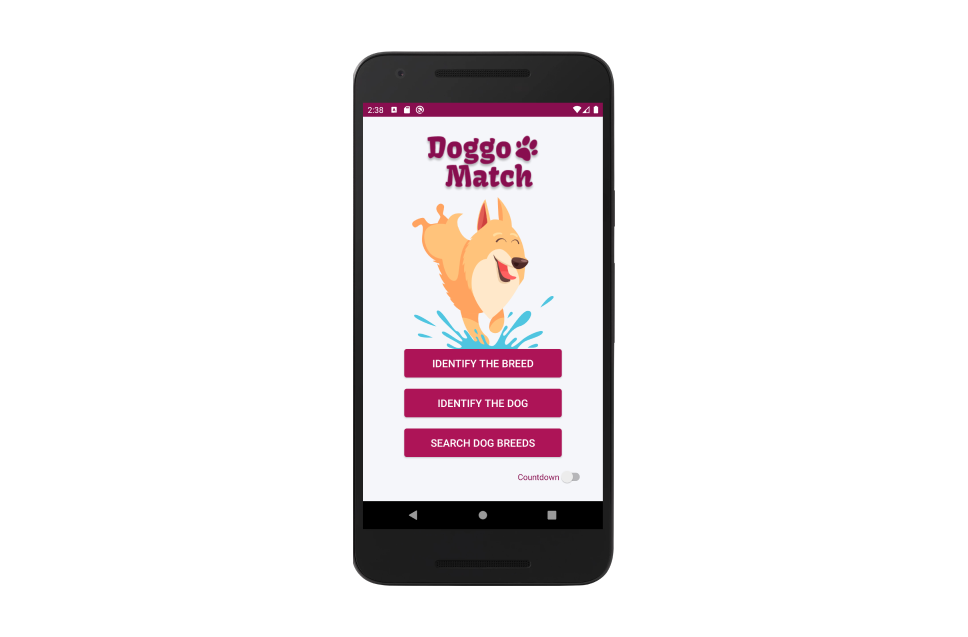
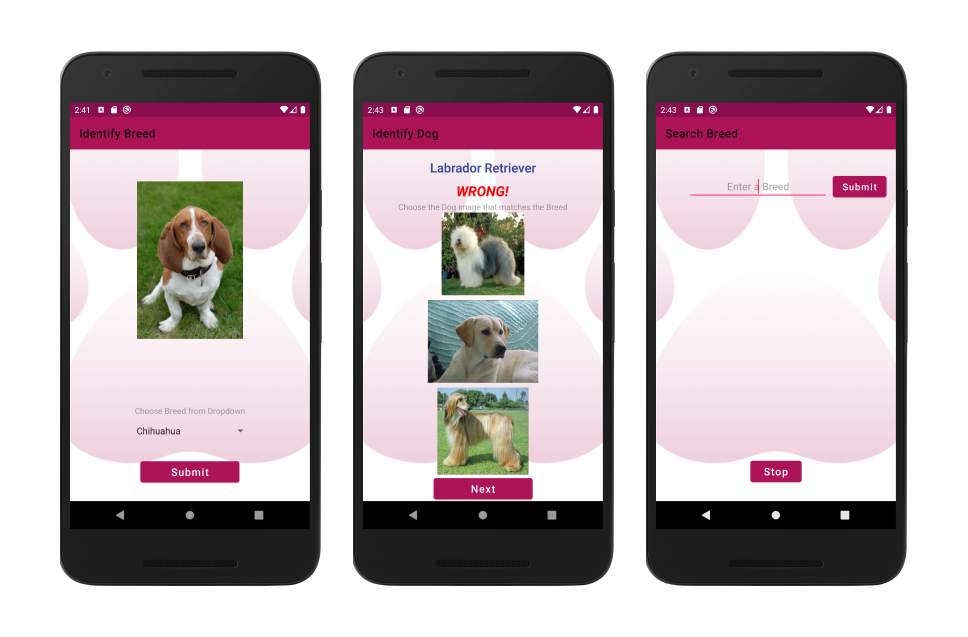
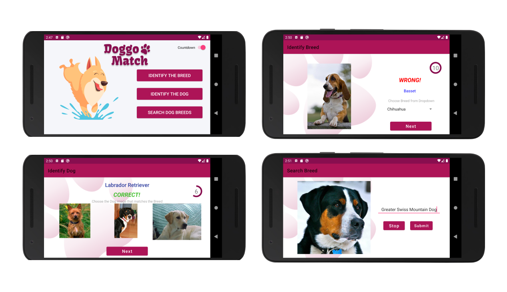

# Doggo Match

### A MATCH MADE IN KENNEL!

Doggo Match is a game that tests a user&#39;s knowledge on various breeds of Dogs. The user can choose to either identify a breed from an image of a dog or identify a dog from the name of the breed. There&#39;s also an option to extend the user&#39;s knowledge on dog breeds by searching for a breed and viewing images of dogs related to that particular breed.
 The game was made for Android OS as part of the Mobile Application Development module that I followed in my 2nd year.

## Technology behind Doggo Match
1. Development IDE - Android Studio 3.5.3
2. Main development language – Java &amp; XML
3. Tested AVD - Nexus 5X
4. Tested API Level - API 29

## Home Screen of Doggo Match game
Displayed below is the Home screen of the **Doggo Match** game.

The first screen (main screen) welcomes the user into the game with a cheerful, playful image of a dog with the logo of the game. This screen presents the user with 3 options which allows the user to choose the game that the user desires to move forward with. It also has a toggle Countdown option which the user can turn on, if the user wants the first two games to be more challenging with a countdown.

The 3 options shown in the main screen opens the following screens:
- **IDENTIFY THE BREED:** Identify the Breed of the Dog image displayed game.
- **IDENTIFY THE DOG:** Identify the Dog image when the Breed is displayed game.
- **SEARCH DOG BREEDS:** Lets the user search for images of a specific breed and view in a slideshow.

## Featured Screens of Doggo Match game

### Identify the Breed Game

In this game, one random image of a dog of a random breed is displayed to the user. The user can use the spinner to choose a dog breed from a dropdown list which includes all the names of the breeds. When he clicks on the &quot;Submit&quot; button, the user will be displayed with the correctness of his answer. If incorrect, the name of the correct breed will be displayed below the result. The user will be displayed with a &quot;Next&quot; button to continue playing the game.
 If the countdown timer is turned on, the user will be allowed to choose a breed only till the timer is reaches 0.

### Identify the Dog Game

In this game, a random breed name is displayed together with the image of the breed and 2 other random dog images of random breeds. All 3 images displayed are of unique breeds. There&#39;s only one correct answer. The user is instructed to choose one image relevant to the breed displayed. The correctness of the chosen image will be notified to the user, below the name of the breed.
 When the countdown timer is turned on, if the user doesn&#39;t choose an image by the time the countdown timer reaches 0, the message &quot;Time&#39;s Up!&quot; will be displayed.

### Search Breed

The user can input a name of a dog breed into the text field displayed. When the Submit button is clicked, if the name entered exists in the app, a slideshow of images relevant to that breed will be shown to the user. This option is for the user to extend his/ her knowledge about dog breeds.
 The user can stop the slideshow by touching the &quot;Stop&quot; button.

## Basic functionalities developed in the game
- The CountDownTimer offered by Android OS was used for all countdown related events. The countdown timer was repeated whenever required by calling the start() method when the countdown timer finished ticking.
- The countdown timer ticks for 10 seconds in the first 2 games and for 5 seconds each in the &quot;Search Breeds&quot; slideshow. Every tick of the countdown timer occurs after 1 second.
- As soon as the countdown timer reaches 0, the result is displayed to the user.
- For the 2 and the slideshow, every single image displayed is unique.
- When the device is rotated from portrait to landscape and back to portrait, the application resumes from the exact same point (views &amp; data).

## Extra functionalities that I developed in the game
- A circular countdown time progress that appears when the countdown timer is running in the &quot;Identify the Breed&quot; &amp; &quot;Identify the Dog&quot; games. The circular progress bar was created using a ring drawable, since the circular progress available in Android isn&#39;t determinate. The flat progress bar was used and swapped with a ring drawable to get the determinate option available for the flat progress bar.
- The circular countdown progress appears in the primary dark colour of the theme of the app at first, then turns Orange when the timer gets to 5 seconds and red when it gets to the last 2 seconds.
- If the user choses an answer before the countdown timer ends, the timer stop and gets reset when the next images are requested to be shown by the user.
- The countdown timer and progress bar are displayed only if the user chooses the countdown option in the main screen.

- The keyboard is minimized when the “Submit” button is pressed in the Search for Dog game. This makes it easy for the user to comfortably watch the slide show of dog images without trying to close the keyboard.
- If the user chooses a Breed that is non-existent in the app, the user is notified to check if the name of the breed entered was erroneous in a toast message.

- Once all the images of a particular breed are displayed in the “Search Breed” slideshow, the slide show stops, preventing the program going into an infinite loop and crashing.

## Considerations taken when designing the UI/ UX of the game
- Used Material UI theme for mainly buttons to get clean, clear and visually appealing buttons. Added a ripple effect to all the buttons.
- Material Design - Color Tool was used to pick most of the colours.
- Removed the title bar of the app from the main screen and displayed the logo that I created instead.
- The countdown timer was placed on the top left of all the screens to make it easy for the user to see it without much effort. • A pinkish colour theme was used to give a playful, fun feeling as this is a game.
- The instructions to be followed are displayed in all the screens. 

## Landscape Layouts of all the screens

Landscape layouts were created for all the screens.
 In all the landscape layouts, all the user input areas were kept to the right and the image displays were kept to the left/ the centre as required. This makes it easier for the user to enter input and makes it comfortable for the user to view the images displayed as most people are used to reading from the left of the screen. 

### Software used to design UI elements
- Figma
- Adobe Illustrator 
 
### Referred links to upload the app to Google Play Store:

[https://medium.com/mindorks/upload-your-first-android-app-on-play-store-step-by-step-ee0de9123ac0](https://medium.com/mindorks/upload-your-first-android-app-on-play-store-step-by-step-ee0de9123ac0)

[How To Upload Android App on Google Play Store | Publish App on Play Store](https://www.youtube.com/watch?v=8v0r_6mYgF8)

[How To Upload Android App on Google Play Store | Publish App on Play Store Part-2](https://www.youtube.com/watch?v=YWfKnswgd4k)

Privacy policy generator
[https://app-privacy-policy-generator.firebaseapp.com/#](https://app-privacy-policy-generator.firebaseapp.com/)

Privacy policy hosted location
[https://doggo-match.flycricket.io/privacy.html](https://doggo-match.flycricket.io/privacy.html)
